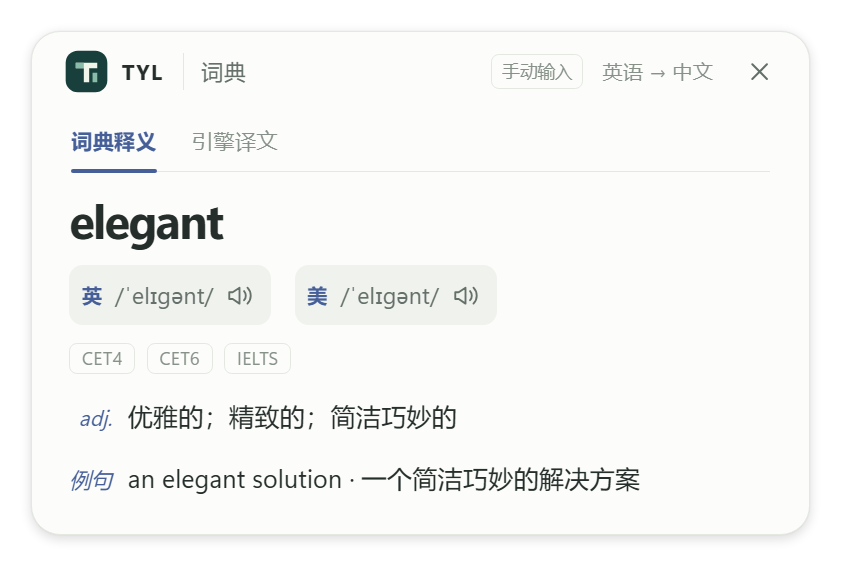
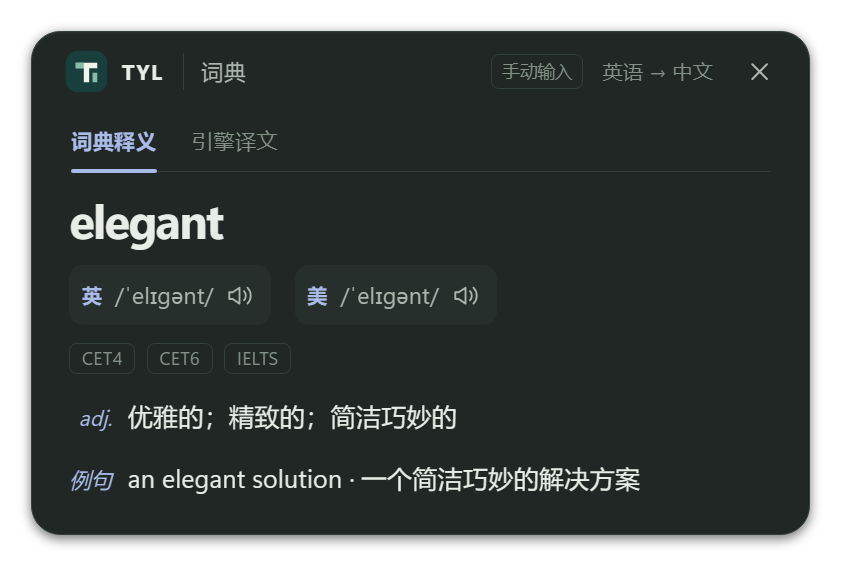
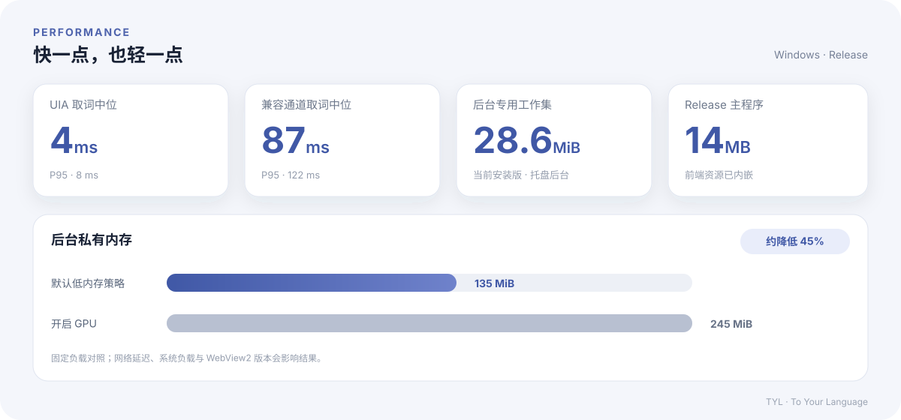

<p align="center">
  
</p>

<h1 align="center">TYL · To Your Language</h1>

<p align="center">
  <strong>开箱即用的跨平台划词翻译工具</strong><br>
  选中文字，按下快捷键，译文就在眼前
</p>

<p align="center">
  <a href="https://github.com/T-winkle/TYL/actions/workflows/ci.yml"></a>
  
  
  <a href="LICENSE"></a>
</p>

<p align="center">
  <a href="https://github.com/T-winkle/TYL/releases/latest"><strong>下载最新版</strong></a>
  · <a href="#快速开始">快速开始</a>
  · <a href="#性能数据">性能数据</a>
  · <a href="#本地开发">参与开发</a>
</p>

<p align="center">
  
  
</p>

> [!IMPORTANT]
> 当前公开测试版为 `0.1.0-beta.5`，率先支持 Windows 10 / 11 x64。测试版暂未进行 Windows 代码签名，首次运行可能出现 SmartScreen 提示；请只从本仓库下载并核对 SHA-256。

## 为什么是 TYL

<p align="center">
  <strong>无需 Key　·　低延迟　·　低内存　·　剪贴板无污染</strong>
</p>

<p align="center">
  <sub>默认引擎开箱即用　/　UIA 取词中位约 4 ms　/　后台专用工作集约 30 MiB　/　剪贴板无取词记录</sub>
</p>


## 快速开始


从 [GitHub Releases](https://github.com/T-winkle/TYL/releases) 下载对应版本。


启动后 TYL 静默驻留系统托盘：

1. 选中单词、句子或段落。
2. 按下 **Alt+T**。
3. 查看词典释义或译文，按需切换引擎、复制结果，或在可编辑区域替换原文。
4. 从托盘菜单进入设置或退出程序。

> [!TIP]
> Windows 11 通常已经包含 WebView2 Runtime；系统缺失时，安装包会调用微软引导程序联网安装。

## 核心体验

### 更友好的取词

- 优先使用 Windows UI Automation 读取选区，不触碰剪贴板。
- UIA 不可用时自动进入兼容通道，保存并恢复剪贴板多格式数据。
- 临时内容带 Ditto / Win+V 隐身标记，并通过序列号守卫避免覆盖第三方的新写入。
- 终端等高风险应用不模拟 `Ctrl+C`，避免向正在运行的命令发送中断信号。
- 自动清理首尾空白、连续空行和排版截断换行，同时保留自然段落、列表和代码缩进。

### 词典与文本翻译分离

- 单词优先展示独立词典卡片，支持英式、美式音标及发音。
- 文本引擎按需启用、禁用和排序，首项作为默认引擎。
- 标签模式在首次切换时请求对应引擎；全部展开模式并行加载多个结果。


默认提供必应、有道、腾讯 TranSmart、Yandex、金山和 Google 等免 Key 接入；也可以配置任意兼容 OpenAI `/chat/completions` 协议的 AI 服务。

> [!NOTE]
> 部分免 Key 引擎来自公开网页或移动端接口，不提供可用性 SLA，服务方调整后可能暂时不可用。需要稳定商用保障时，请配置正式 API 或自己的 OpenAI 兼容服务。

### 安全、克制的替换

- 替换前重新验证目标窗口、控件身份、可编辑状态和原始选区。
- 密码框、只读区域、终端以及无法安全确认的控件不会注入按键。
- 验证失败时保留译文供复制，不冒险覆盖未知内容。

### 低占用设计

- GPU 硬件加速默认关闭，优先降低显存与私有提交；需要更稳定的复杂动画时可开启。
- 弹窗隐藏 15 秒后请求 WebView2 LOW 内存级别，再次划词时恢复 NORMAL。

## 性能数据

<p align="center">
  
</p>

**内存口径：** 专用工作集约等于当前独占的物理内存；私有内存是独占承诺量，部分页面可能已换出；总工作集包含共享页面，多进程求和时可能重复统计。


## 本地开发

TYL 当前面向 Windows 构建。开始前先从托盘退出正在运行的旧版本，避免可执行文件被占用。

```powershell
npm --prefix apps/tyl-app/ui ci
npm --prefix apps/tyl-app/ui run check
npm --prefix apps/tyl-app/ui run build
cargo fmt --all --check
cargo clippy --workspace --all-targets -- -D warnings
cargo test --workspace
cargo build -p tyl-app
.\target\debug\tyl-app.exe
```

界面预览：

```powershell
npm --prefix apps/tyl-app/ui run dev
```

打开 `http://localhost:1420/preview.html?case=dict&theme=dark`。`case` 可选 `dict` / `short` / `long` / `stacked` / `error`，设置页使用 `?page=settings&theme=light`。

```text
crates/
├── tyl-core/       平台无关契约、热键、定位与文本清理
├── tyl-platform/   Windows UIA、剪贴板与选区能力
└── tyl-cli/        取词与显示器诊断工具
apps/tyl-app/
├── src-tauri/      Tauri 壳、翻译引擎、设置与窗口生命周期
└── ui/             SolidJS 弹窗、设置页与回归预览
```

## 当前边界

- 当前只正式支持 Windows 10 / 11 x64。
- 自绘编辑器应用暴露的 UIA 能力因版本而异；无法安全确认选区时，替换功能会拒绝执行，但复制译文仍然可用。
- 尚未提供自动更新。


